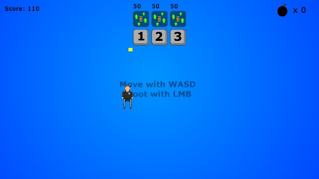
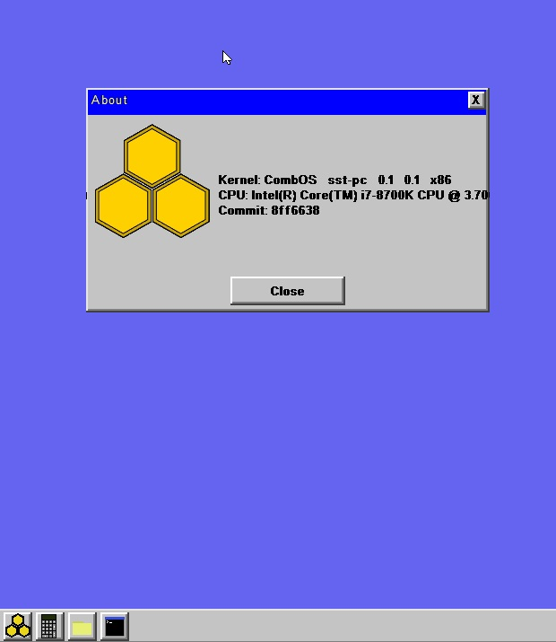
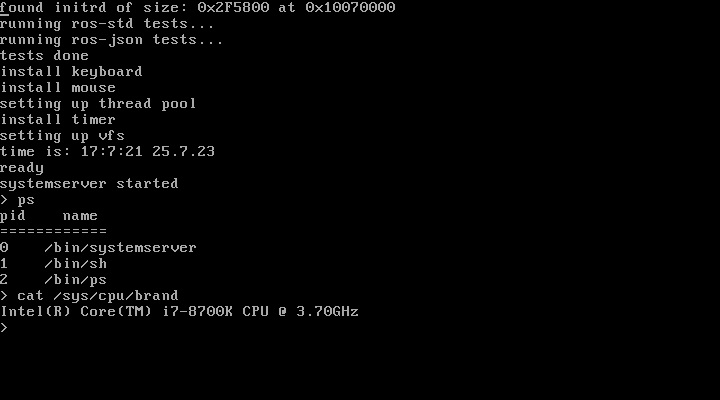
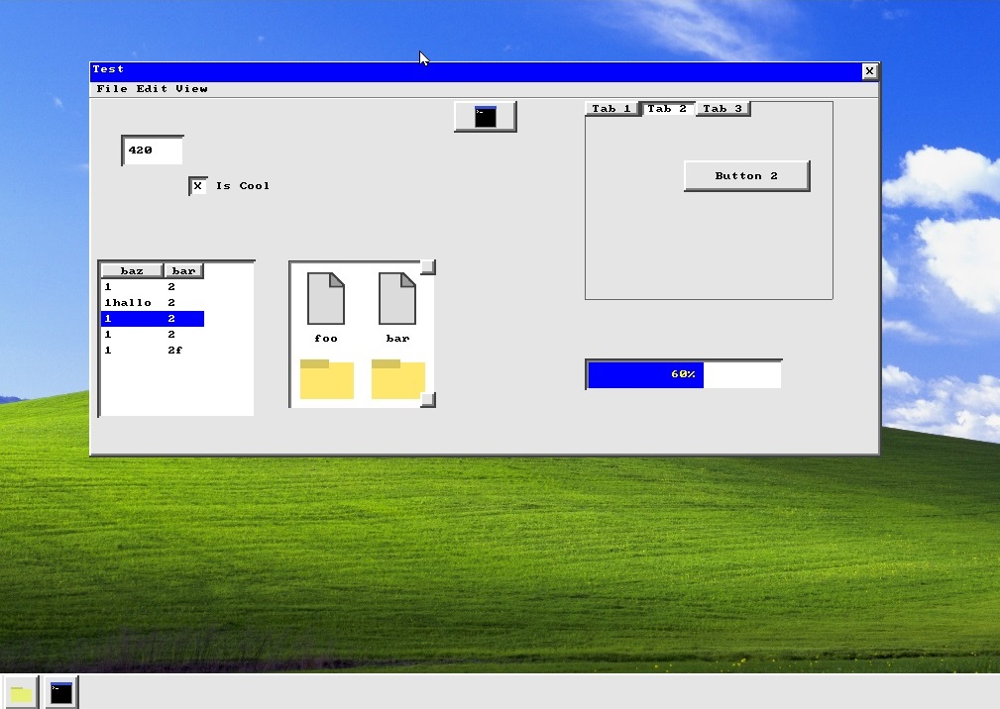

# Writing my own OS in Rust

## Intro

As this is the first post on here I will try to give a short introduction about myself and why I started writing my own operating system.

In 2019 I discoverd the YouTube channel of [Andreas Kling](https://www.youtube.com/c/andreaskling) showing the progress he made writing his own OS. I have been following him and the progress of his project [Serenity OS](https://github.com/SerenityOS/serenity) ever since. I was really amazed by how he was able to explain all the stuff he showed so well, from the GUI all the way down to the Kernel.

Being just 20 at the time and in the middle of my IT apprenticeship I didn't have a lot of experience programming. I already knew a bit of Java from learning it in school a couple years earlier. In trade school we started with C to learn how the CPU, Stack and Heap work, at work I was writing C# and VB.Net for various applications. As I was using Visual Studio at work I noticed it also ships with MSVC (the Microsoft C/C++ Compiler). I used that to learn for school and teach myself C++ when there was nothing else for me to do. Soon I used C++ for almost all my hobby programming projects, for which I previously used a mix of C# and Java.

At the time I was really into C++ game and game engine development. One game I actually finished was my try at Ludum Dare 44 , the theme was **Your Life is Currency**. I still think this is one of my better hobby projects, and although I didn't publish it many of my friends back then tried it and gave feedback.



*Screenshot of the game for Ludum Dare 44*

## Starting my first OS

After finishing my apprenticeship in late 2020 and joining the company as a normal employee I slowly took over most of the programming related work from a colleague that was about to retire. Every morning at work when checking server logs and backups, seeing all the logs from different OS services (Windows Server btw), I was thinking to myself "it would be so cool making my own OS, writing all these services myself and just understanding how all the OS components work together". This may sound silly, why would I need to know how interrupts work or how a compositor handles all the windows on screen when I'm just writing simple C# programs at work. I really wanted to know. Still watching Kling's videos every now and then I started working on my own operating system using C++. First following the [OSDev Wiki](https://wiki.osdev.org/Main_Page) kind closely, but later just going on my own and implementing functionality how I thought was right, loosely basing it on POSIX. I won't go into much detail about implementing things like interrupts, memory management or scheduling here, but I'll likely do this in future posts.
Getting used to the build systems was pretty rough, coming from Visual Studio that takes care of most things for you. But it was satisfying to type `make run` in my console for the first time and seeing everything getting compiled and qemu getting launched with the ISO mounted.



*Screenshot of the desktop showing taskbar and the `About` application.*

## Going downhill

I also implemented my own standard library with all the types one would expect like `UniquePtr`, `SharedPtr`, `String`, `Vector`, `HashMap` and so on. Even though I had tests in place for all these types every now and then some applications or even worse the Kernel would crash or hang without any assertion failures leaving me puzzled. First I just ignored it but the larger the project grew the more frequent the crashes became. Also the performance started to degrade a lot, this was probably because I implemented all the standard library type myself leading to bad performance. This was something only [Tom](https://thedailywtf.com/articles/the-inner-json-effect) could fix, he's a genius after all. Frustrated with with the poor performance of my OS I started to commit less and less time to it. I knew to fix a lot of the problems I probably had to start all over again. At this point I was working on the project for almost over a year on and off. Sadly I did not use git from the very beginning so the commit history starts with the OS already largely functional. In February 2023 I completely stopped working on the project.

The OS did not turn out as good as I had hoped, but I still learned a lot. Implementing my own standard library really taught me a lot about data structures. For example how a hashmap works and how to deal with hash collisions or how you can use templates in C++ to find out how to safely copy types with `Traits<T>::IsPrimitive()` when expanding a `Vector<T>`.

One thing I am particularly proud of is my implementation of an easy to use formatter allowing formatting of custom types.
Allowing me to do stuff like this:

```cpp

StringBuilder builder;
builder.Appendf("Hello {} I am {} years old. 0x{x}", "World, ", 23, 0xAFFE);

```

Formatting for a custom type can be added by implementing a template specialization of the `CustomFormatter<T>` struct like this:

```cpp

// Simplified but you should get the idea

template<>
struct CustomFormatter<StringBuilder>
{
	static const char* FormatValue(const StringBuilder& value)
	{
		return FormatValue(String::Formatted("StringBuilder{ size={}, buffer=\"{}\" }", value.Size(), value.ToString()));
	}
};

```

## Starting over

While slowing down my OS development I was learning Rust and began to like it a lot. When I stopped working on my C++ OS I was already somewhat proficient in Rust but still had a lot to learn. Wanting to try myself at a larger Rust project I picked up the idea of my own OS again. This time starting with [Writing an OS in Rust](https://os.phil-opp.com/) by Philipp Oppermann. But just like last time I was quick to start following my own ideas and trying out many different things. All while still learning Rust. It's really funny looking back at the first couple lines of code I wrote and thinking to myself "what kind of idiot writes code like this?". 

Again I implemented all the basic Kernel stuff like in my previous attempt. But one thing i just could not get to work: loading elf binaries. Everything seemed to work, but as soon as i called the `format!` macro in an application everything crashed. I tried lots of stuff and combed through all sorts of forums (ChatGPT wasn't really a thing yet). Nothing worked, I was starting to loose interest again but didn't want to give up again.

After weeks of trying different solutions to my problem I just said **screw it** and just linked all crates and applications together with the kernel and a small C helper program into a single image which gets loaded when booting. I don't know if you can still call this an operating system as it's basically just a single application running where each process is a function executing in it's own thread.

## Entering userland

Now that the problem of loading programs was no more I could finally focus on building the user space. I first started with a VGA text mode console and some utilities like `ls`, `ps` and `cat`.



*Screenshot of text mode console*

With some basic utilities done I started work on the `WindowServer`, the program which will combine all GUI windows into a single image to be display on screen and handle all the user generated events like key strokes and mouse clicks. The general strategy used was quite similar to the one used in my previous OS, some minor changes were made to make it play nicer with the rules imposed by Rust. After getting the first window up and running I started work on a GUI library similar to Winforms from the .Net ecosystem. This turned out to be a mistake, as C# a garbage collected language does not impose the same constraints Rust does when it comes to mutability, lifetimes and memory safety. The Winforms approach for my Rust crate led to a lot of `RefCell<Vec<Rc<dyn Widget>>>` related headaches as having lots of shared mutable references to objects does not translate nicely from C# to Rust. Manually setting the X and Y positions as well as the size for each and every widget was also exhausting. At least with C# and Visual Studio you get a visual editor to throw together quick and dirty GUIs.



*Showcase of most widgets available in the GUI crate*

That being said I still wrote a bunch of graphical applications including a Task Manager style program to view and terminate processes, a file manager, a text editor, a terminal emulator and the taskbar you can see at the bottom of the screenshot above.

## What's next

As outlined above I am not satisfied with the current state of my GUI crate. I already started to work on a new one and hope to have a post about that one up soon.

Continuing with the OS development I still have some ToDos on my list, but I plan to continue the development for as long as I have fun and new ideas.

I also want to do some more posts on here about the (very limited) networking stack, a deep dive into the WindowServer and more possibly non OS related stuff.

## Conclusion

While I was able to write code before, being interested in OS development and lower level languages really helped me to grow as a programmer. Spending the time to learn about something you use daily and almost take for granted can be time consuming but also very rewarding. I never really understood hashmaps until I had to implement one myself for my operating system. It is a very bad implementation, but now I do understand how they work. All in all this was and still is a great learning experience, as I still have lots to learn.


